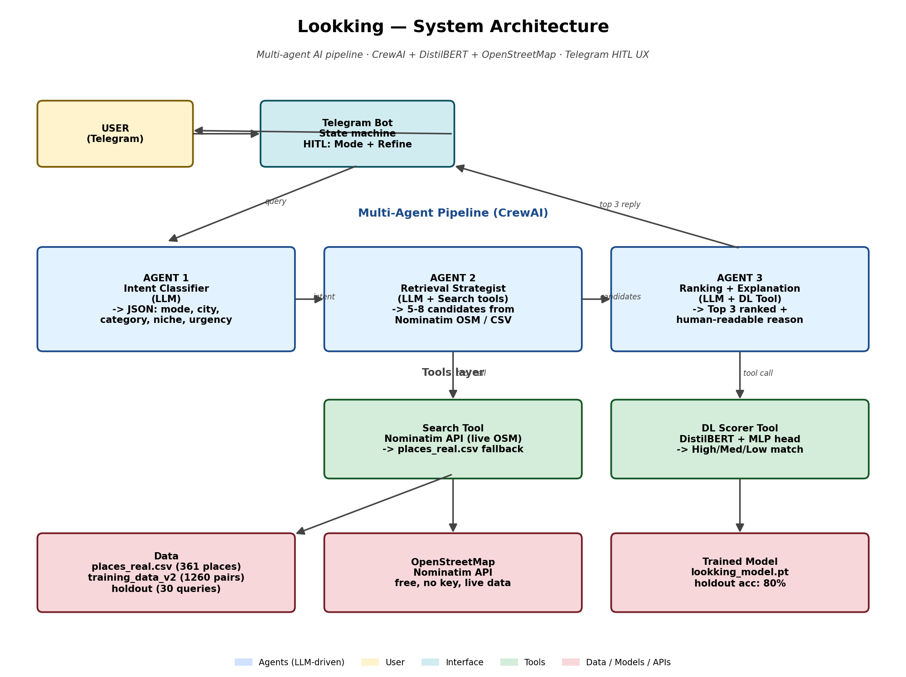

# Lookking

> Multi-agent AI assistant for finding **places** and **business leads** in Morocco via Telegram.



---

## What it does

Send a casual message to the bot — `"luxury spa Rabat"`, `"gym in Casablanca"`, `"I offer video editing for restaurants"` — and get back the **Top 3 best-matching results**, each scored by a fine-tuned DistilBERT classifier with a one-line reason and a clickable Google Maps + OpenStreetMap link.

Two modes:
- **Place finder** — restaurants, spas, gyms, cafes, hotels across Morocco
- **Lead finder** — local businesses that match a freelancer's service offer

---

## Architecture

Three agents in a sequential pipeline (CrewAI). Each owns one decision.

| Agent | Input | Output |
|---|---|---|
| **Intent Classifier** | raw user text | structured JSON `{mode, city, category, niche, urgency}` |
| **Retrieval Strategist** | intent JSON | 3–5 candidates via live Nominatim or CSV fallback |
| **Ranking & Explanation** | candidates + query | Top 3 ranked by DistilBERT score, with reason + map links |

---

## Deep learning model

Fine-tuned **DistilBERT** for query-candidate relevance classification.

```
[QUERY]: <user query>  [SEP]  [CANDIDATE]: <place description>
                       |
                       v
        DistilBERT (66M params, layers 0-3 frozen)
                       |
                       v  [CLS] vector (768-dim)
                MLP head  768 → 256 → 64 → 3
                       |
                       v  softmax
              { Low, Medium, High }
```

**Training data:** 1,260 query–candidate pairs from **361 real OSM places** crawled across 9 Moroccan cities and 11 categories.

| Metric | Test split (20%) | Holdout (30 unseen queries) |
|---|---|---|
| Accuracy | **88.89%** | **80.00%** |
| Macro F1 | 0.83 | 0.71 |

Training script: `model/train_v2.py`. Results: `model/metrics_v2.json`.

---

## Quick start

```bash
git clone https://github.com/akoudad/lookking.git
cd lookking

python3 -m venv venv && source venv/bin/activate
pip install -r requirements.txt

cp .env.example .env
# Add TELEGRAM_TOKEN + at least one LLM key (GROQ_API_KEY recommended)

# One-time setup: collect data + train model
python3 data/collect_real_places.py
python3 data/build_training_v2.py
python3 model/train_v2.py

# Run
python3 main.py
```

Message your bot `/start` on Telegram and pick a mode.

---

## LLM backends

Default: **Groq llama-3.3-70b-versatile** (free). Auto-fallback to Gemini → Cerebras on rate limit.

```bash
LLM_PROVIDER=groq     python3 main.py   # default
LLM_PROVIDER=gemini   python3 main.py
LLM_PROVIDER=cerebras python3 main.py
```

---

## Stack

| Layer | Tech |
|---|---|
| Bot | python-telegram-bot |
| Agents | CrewAI 1.14.4 |
| LLM | Groq / Gemini / Cerebras (free tiers) |
| DL model | PyTorch + HuggingFace Transformers |
| Place data | OpenStreetMap Nominatim |
| Cost | $0 |

---

## Limitations

- Ratings derived from OSM importance score, not real user reviews
- Leads mode uses a synthetic CSV (no free public business-lead API)
- English only — French/Arabic support planned
- No result persistence between sessions

---

## Author

Karim Akoudad — UIR, AI & Big Data, 2026.
